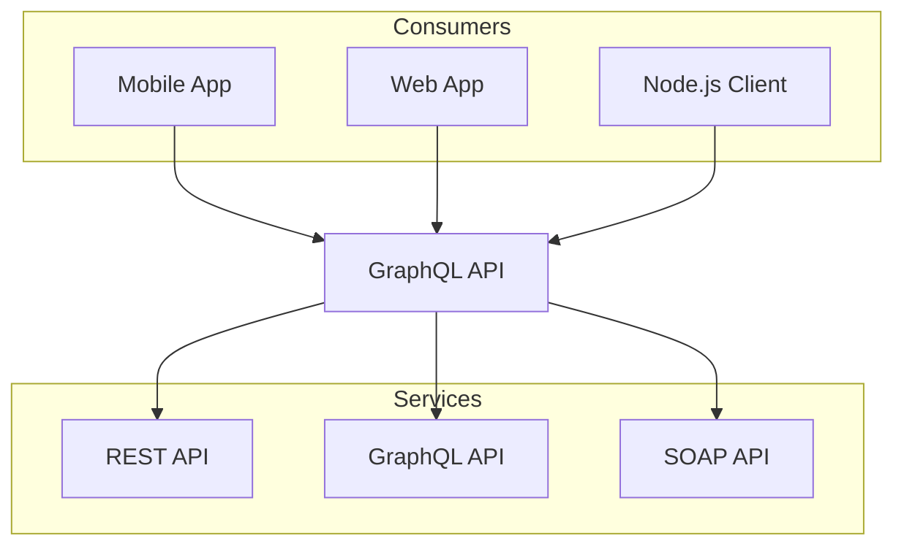

# Welcome to Nextra
 
Hello, world!

import { Callout, Playground } from 'nextra/components'
 
<Callout emoji="👾">
  **Space Invaders** is a 1978 shoot 'em up arcade game developed by Tomohiro
  Nishikado.
</Callout>

# Playground
 
Below is a playground component. It mixes into the rest of your MDX perfectly.
 
<Playground source="## Hello world" />

import { ProgressDemo } from '../components/test'

<ProgressDemo />

```ts twoslash
// @errors: 2540
interface Todo {
  title: string
}
 
const todo: Readonly<Todo> = {
  title: 'Delete inactive users'.toUpperCase()
  //  ^?
}
 
todo.title = 'Hello'
 
Number.parseInt('123', 10)
//      ^|
               // Just comments, so Popup will be
               // not behind the viewport of `<code>`
               // element due his `position: absolute` style
               //
```

Playground components allow you to write Nextra compatible MDX that renders only on the client. It's modeled after the functionality found in [MDX Playground](https://mdxjs.com/playground).

In some instances where remote loading MDX is not an option, this may work as a great alternative.

Here's an example of a codeblock.

```ts
console.log("Hello world, this is a playground component!");
```

## Caveats

Due to the purely client-side nature of this component, features "Table of Contents" and "Frontmatter" will not work.

## Mermaid Example



import { AlertDemo } from '../components/code'

<AlertDemo />

import {MarqueeDemo} from '../components/reviews';

<MarqueeDemo />